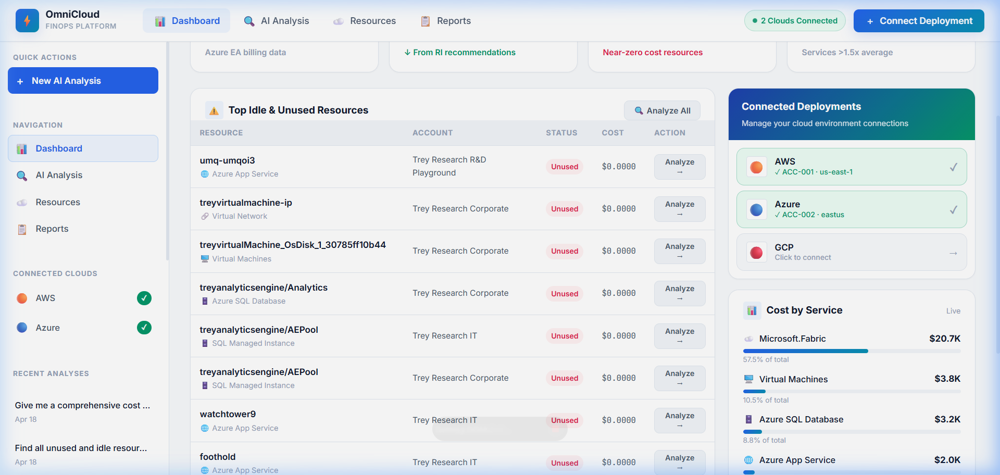
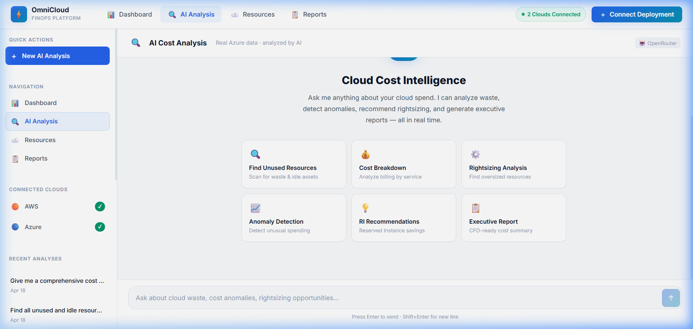
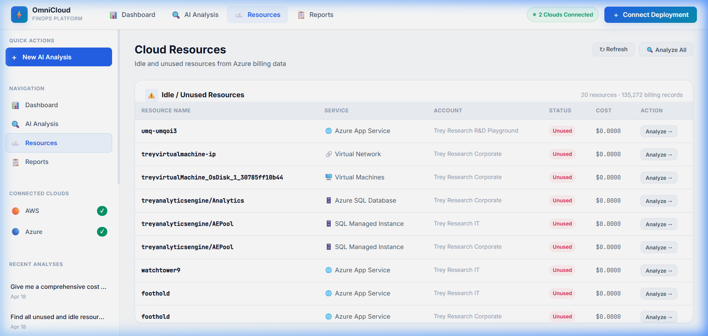
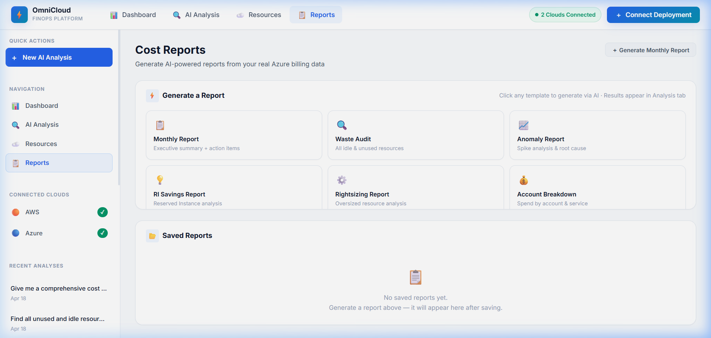

<p align="center">
  
</p>

# 🚀 OmniCloud FinOps Agent
### *Shift-Left Cloud Cost Intelligence — Multi-Cloud Agentic FinOps System*

[]()
[]()
[]()
[]()

---

## 📉 The Problem: Cloud Cost Chaos
Managing cloud expenditures across fragmented environments (AWS, Azure, GCP) is a persistent challenge for modern engineering teams. 
- **Hidden Costs**: Idle or forgotten resources consume budgets silently.
- **Latency in Insights**: Monthly billing cycles mean "cost surprises" are discovered too late.
- **Complexity**: Navigating native cloud consoles requires deep expertise and manual auditing.
- **Missed Optimization**: Reserved Instance (RI) savings and rightsizing opportunities are often overlooked.

## 🎯 The Solution: OmniCloud FinOps Agent
OmniCloud provides a centralized, AI-driven command center for **Cloud Cost Intelligence**. It bridges the gap between raw billing data and actionable decisions by providing:
- **Instant Visibility**: Real-time KPI dashboards for enterpise-wide spend.
- **AI-Driven Audits**: A powerful "Agentic" chat interface that performs manual audits in seconds.
- **Predictive Optimization**: Automated anomaly detection and RI recommendations.
- **CFO-Ready Reporting**: Professional, data-driven cost reports generated via AI.

---

## 🖼️ Visual Tour

### 📊 Real-Time Dashboard
*A high-level view of cloud expenditures, anomalies, and potential savings.*


### 🤖 AI Cost Analyst
*Query your cloud costs using natural language. The agent uses MCP tools to fetch live data.*


### 🧹 Resource Intelligence
*Identify and analyze idle or unused resources across all connected accounts.*


### 📝 Executive Reporting
*Generate professional markdown reports summarizing cost optimizations and action items.*


---

## 🔄 How it Works: The Workflow

### 1. **Data Connection & Ingestion**
The system connects to cloud provider APIs and EA Focus billing data.
- **Azure**: Uses Enterprise Agreement (EA) FOCUS 1.0 billing CSVs (135K+ records).
- **AWS**: Integrates with Cost Explorer and Boto3 for resource metadata.

### 2. **Agentic AI Core**
When a user asks a question, the **OmniCloud Agent** begins an iterative loop:
- **Context Synthesis**: Fetches history and metadata from Firebase.
- **Tool Selection**: Uses **Model Context Protocol (MCP)** to trigger specialized tools:
  - `query_azure_billing`: Group and filter millions of cost line items.
  - `cost_anomaly_detector`: Find price spikes using statistical analysis.
  - `analyze_ri_recommendations`: Calculate potential ROI on reserved instances.
- **Executive Summary**: Synthesizes raw data into CFO-friendly insights.

### 3. **Persistence & Feedback Loop**
- All chat sessions and generated reports are stored in **Firebase Firestore**.
- Users can refine analyses and save specific reports for stakeholder review.

---

## 🛠️ Technology Stack

| Layer | Technologies |
|---:|:---|
| **Frontend** | React 19, Vite, Vanilla CSS, React Markdown, Lucide Icons |
| **Backend** | Python 3.13, FastAPI, Uvicorn, Pandas, HTTPX, Boto3 |
| **Database/Auth** | Firebase Admin SDK, Firestore |
| **AI/LLM** | Gemini 3 Pro, OpenRouter, Model Context Protocol (MCP) |

---

## ⚙️ Getting Started

### Prerequisites
- Python 3.11+
- Node.js 18+
- Firebase Service Account Key (`serviceAccountKey.json` in root)

### 1. Backend Setup
```bash
cd backend
python -m venv .venv
source .venv/bin/activate  # or .\.venv\Scripts\activate on Windows
pip install -r ../requirements.txt
uvicorn main:app --reload
```

### 2. Frontend Setup
```bash
cd frontend
npm install
npm run dev
```

### 3. Configuration
Copy `.env.example` to `.env` and configure your API keys:
- `OPENROUTER_API_KEY` or `GEMINI_API_KEY`
- `FIREBASE_CREDENTIALS_PATH` (default: `./serviceAccountKey.json`)

---

## 📜 License
Distributed under the MIT License. See `LICENSE` for more information.

---
<p align="center">Built with ❤️ for the FinOps Community</p>
